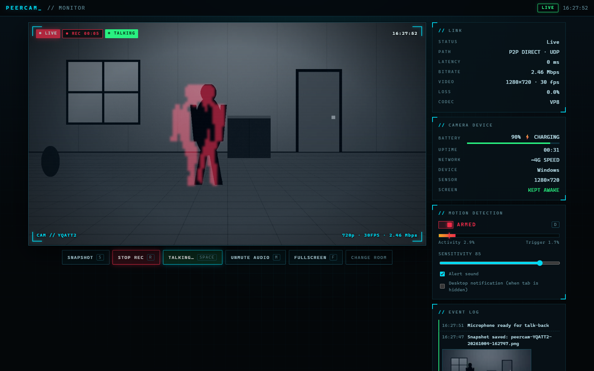
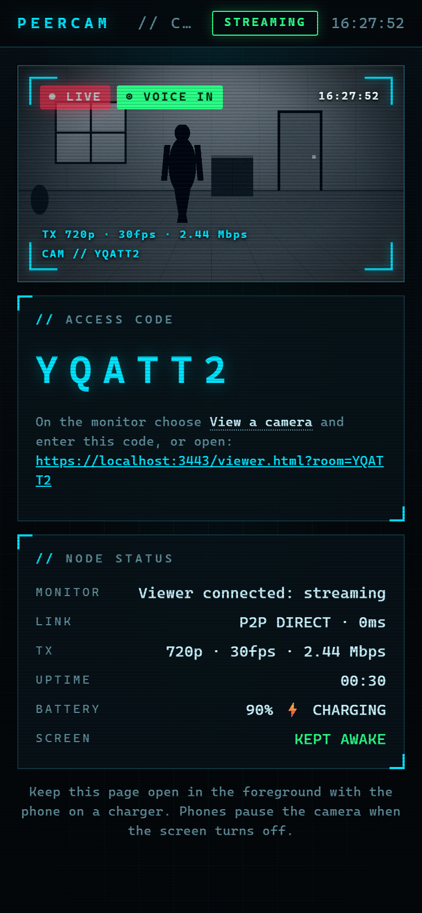
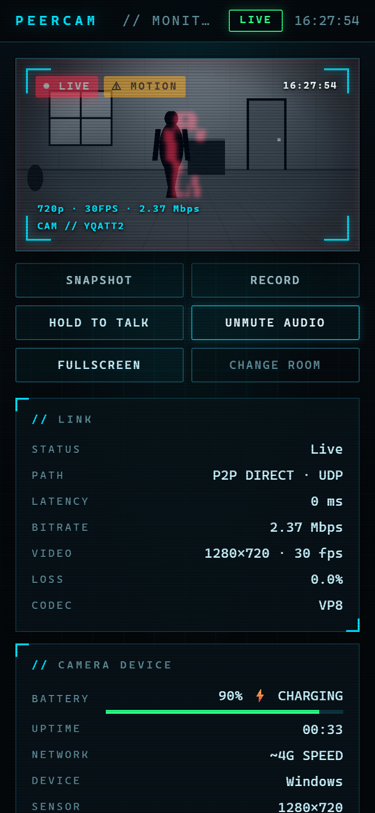
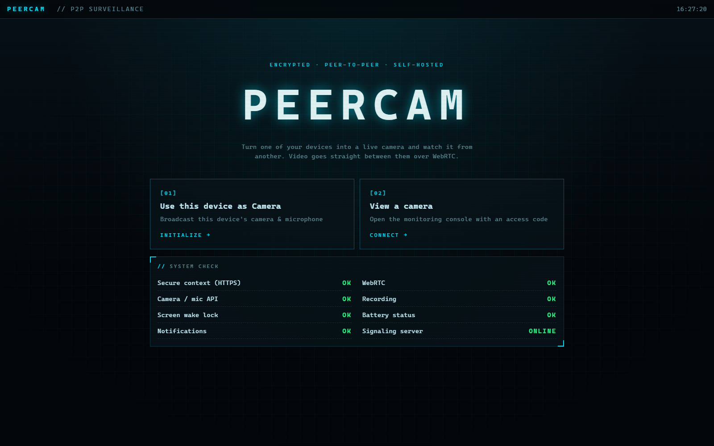
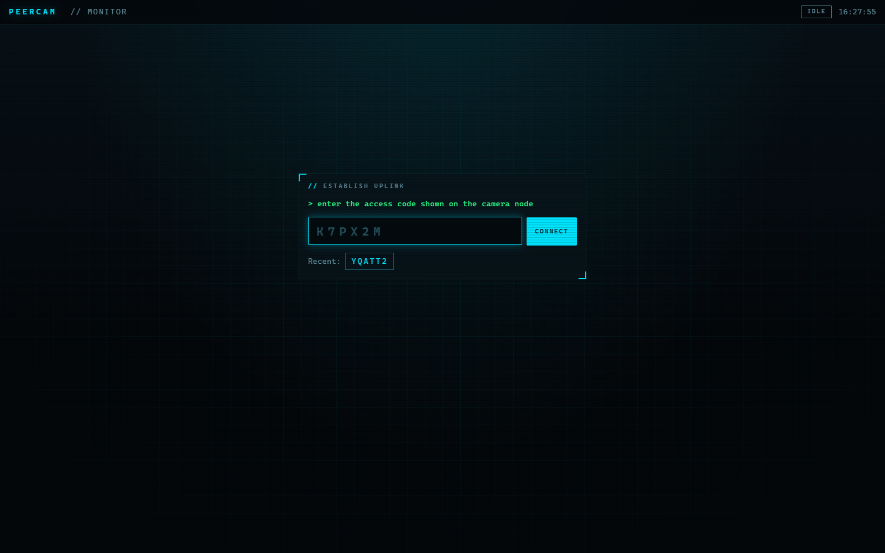

# PeerCam

**A self-hosted, peer-to-peer security camera in your browser.** Turn one device (e.g. your
phone) into a **camera node** and watch it live, with audio, from a **monitoring console** on
another device (e.g. your laptop).

- Video and audio travel **directly between your devices** over WebRTC (low latency, encrypted).
- A small Node.js server only serves the pages and relays the few setup messages (signaling).
- No accounts, no cloud, no third-party requests. Snapshots and recordings are saved on your own machine.

> **Phase 1: same Wi-Fi only.** Internet access (TURN server, real certificate, login) is
> phase 2. See [Roadmap](#roadmap).



<table>
  <tr>
    <th>Camera node (phone)</th>
    <th>Monitor on a phone</th>
  </tr>
  <tr>
    <td></td>
    <td></td>
  </tr>
  <tr>
    <th>Landing page + system check</th>
    <th>Connect with an access code</th>
  </tr>
  <tr>
    <td></td>
    <td></td>
  </tr>
</table>

<sub>Screenshots use a synthetic test scene as the camera feed.</sub>

## Features

**Monitoring console (viewer)**
- Live feed with a command-center HUD: corner brackets, clock, ● LIVE / ● REC / TALKING / MOTION badges
- **Live link stats:** connection path (P2P direct or TURN relay), latency, bitrate, resolution/FPS, packet loss, codec
- **Snapshot:** saves a full-resolution PNG with a timestamp burned in
- **Recording:** records video + audio clips (WebM, or MP4 on Safari) straight to your Downloads folder
- **Motion detection:** frame-differencing with a live heat-map overlay, adjustable sensitivity,
  alarm tone, desktop notifications, and an event log with thumbnails. Stays armed across reloads.
- **Two-way talk:** hold the button (or Space) and your voice plays through the phone's speaker
- **Camera device status:** battery level / charging, uptime, network, sensor resolution, screen-awake state
- Keyboard shortcuts, fullscreen, recent access codes

**Camera node**
- Live preview with LIVE badge, access code, and its own link/TX stats
- Keeps the screen awake (Wake Lock API) and plays talk-back audio
- Auto-reconnects. Reloading either side rejoins the same room and the stream resumes on its own.

**Landing page**: a system check that shows whether this device supports everything
(HTTPS, WebRTC, camera API, recording, wake lock, battery, notifications, server online).

### Keyboard shortcuts (monitor)

| Key | Action |
|-----|--------|
| `S` | Snapshot |
| `R` | Start / stop recording |
| `Space` (hold) | Talk to the camera |
| `M` | Mute / unmute camera audio |
| `F` | Fullscreen (or double-click the video) |
| `D` | Arm / disarm motion detection |

---

## Requirements

- **Node.js LTS** (v20 or newer). Check with `node -v`.
  Install on Windows: `winget install OpenJS.NodeJS.LTS`, or download it from https://nodejs.org.
- Both devices on the **same Wi-Fi network**.
- A modern browser: Chrome/Edge/Firefox on the laptop; Chrome (Android) or Safari (iPhone) on the phone.

## Run it

```powershell
git clone https://github.com/kamalarnav04/PeerCam.git
cd PeerCam
npm install      # first time only
npm start
```

The server prints its addresses, for example:

```
  This computer:   https://localhost:3000
  On your network: https://192.168.0.105:3000   (Wi-Fi)
```

**Windows Firewall:** the first time, Windows asks whether Node.js may use the network.
Allow it on **Private networks**, otherwise your phone can't reach the laptop. Your Wi-Fi
connection must be set to *Private* (Settings → Network & internet → Wi-Fi → your network).

## Test with your phone + laptop

1. **Phone (camera):** open `https://<laptop-ip>:3000` (the "On your network" address,
   **with `https://`**).
   - You'll see a "connection is not private" warning. That's expected, because the
     certificate is self-signed (see below).
     - Android Chrome: **Advanced → Proceed to … (unsafe)**
     - iPhone Safari: **Show Details → visit this website → Visit Website**
   - Tap **Use this device as Camera** and allow camera + microphone.
   - Note the **access code** (e.g. `K7PX2M`).
2. **Laptop (monitor):** open `https://localhost:3000`, click **View a camera**, and enter the code.
   - The feed starts **muted** (browsers block autoplay with sound). Press **M** to hear it.
3. **Try the features:** press `S` for a snapshot, `R` to record, hold `Space` to talk, and toggle
   motion detection (`D`) and wave at the camera.
4. **Try the recovery:** reload either page, or lock and unlock the phone. The stream comes
   back by itself.

**Tip:** bookmark the camera page *with its `?room=` code* on the phone, so the code never changes.

### Keeping the camera running

Mobile browsers **pause the camera when the screen turns off or the browser is in the
background**. The camera page asks the browser to keep the screen awake, but for long sessions:

- keep the camera page open in the foreground,
- plug the phone into a charger,
- turn the screen brightness down,
- turn off battery saver (it can block the wake lock).

## Why HTTPS (and the browser warning)?

Browsers only allow camera/microphone access (`getUserMedia`) in a **secure context**:
`https://` pages, or `http://localhost`. Your phone reaches the laptop by IP address, which
isn't `localhost`, so even on your home Wi-Fi the page must be served over HTTPS.

On first start the server generates a **self-signed certificate** (in `certs/`, ignored by
git). It's valid for `localhost`, `127.0.0.1` and your laptop's current LAN IPs. If your
laptop's IP changes, the certificate is regenerated automatically on the next start, and
you'll accept the warning once more.

The connection is encrypted. The browser warns only because no public authority vouched for
the certificate. That's fine on your own network. For the internet, use a real certificate
(phase 2).

### Putting it behind real HTTPS later

The server can run in plain HTTP mode behind something that provides HTTPS (a reverse proxy
like Caddy/nginx, or a tunnel service):

```powershell
$env:USE_HTTP = "1"; $env:PORT = "3000"; npm start
```

The pages connect to the WebSocket at the same host they were loaded from (`wss://` on
HTTPS automatically), so no code changes are needed. The proxy must forward WebSocket
upgrades on the `/ws` path.

| Variable   | Default        | Meaning                                                    |
|------------|----------------|------------------------------------------------------------|
| `PORT`     | `3000`         | Port to listen on                                          |
| `HOST`     | all interfaces | Interface to bind (e.g. `127.0.0.1` for this computer only) |
| `USE_HTTP` | unset          | `1` = plain HTTP, only behind an HTTPS proxy               |

## How it works

```
 Phone (camera.html)          Laptop server (server.js)        Laptop (viewer.html)
 ───────────────────          ─────────────────────────        ────────────────────
 getUserMedia ─┐
               │  join {room, camera} ──►  room ABC123  ◄── join {room, viewer}
               │                          peer-joined ──► both
 createOffer   │  offer ──────────────────► relay ───────────► setRemoteDescription
               │                                               createAnswer
 setRemote...  │  ◄─────────────────────── relay ◄──────────── answer
               │  ◄──── ICE candidates (both directions, relayed) ────►
               └══ audio/video + "control" data channel, directly peer-to-peer ══►
                   ◄══ talk-back audio (viewer mic) ══
```

- **The camera always makes the offer.** Whenever both sides are present in a room,
  including after either one reloads, the server sends `peer-joined`, and the camera
  starts a brand-new connection.
- **Reloads:** if a role (camera or viewer) joins a room where that role is already taken,
  the **newer connection wins** and the old one is closed.
- **Dropped connections:** the server pings every 30 s and removes devices that stopped
  answering. The pages reconnect to the server by themselves.
- **Data channel:** a WebRTC data channel ("control") carries the camera's device status
  to the viewer and the talk on/off state back. It's peer-to-peer, like the video.
- **Two-way talk:** the camera's audio line is two-way (`sendrecv`). The viewer attaches
  its microphone once and just enables it while you hold the button, so talking starts
  instantly with no renegotiation. While you talk, the camera's audio is muted on your
  side to prevent echo (walkie-talkie style).
- **Motion detection** runs entirely in the viewer's browser: a 160 px-wide copy of each frame
  is compared with the previous one, and if enough pixels changed for two frames in a row,
  it's motion.
- **One viewer per room** in this version. Opening the room in a second viewer takes over.

## Project files

| File | What it does |
|------|--------------|
| `server.js` | HTTPS server, static files, WebSocket signaling, rooms, heartbeat, self-signed cert |
| `public/index.html` + `js/index.js` | Landing page with system check |
| `public/camera.html` + `js/camera.js` | Camera node: getUserMedia, offer, data channel, device status, talk-back playback |
| `public/viewer.html` + `js/viewer.js` | Monitoring console: answer, controls, motion, talk, stats, event log |
| `public/js/signaling.js` | WebSocket client with auto-reconnect/rejoin; room-code helpers |
| `public/js/stats.js` | Live WebRTC stats (bitrate, latency, path, loss, codec) |
| `public/js/motion.js` | Motion detector (frame differencing + heat-map overlay) |
| `public/js/media.js` | Snapshot (PNG with timestamp) and clip recording (MediaRecorder) |
| `public/js/hud.js` | Clock, formatters, event log |
| `public/js/config.js` | ICE servers: Google STUN + the **TODO slot for TURN** |
| `public/css/style.css` | The command-center HUD theme |

## Troubleshooting

| Symptom | Fix |
|---------|-----|
| Phone can't open the page at all | Use `https://` (not `http://`). Same Wi-Fi? Allow Node.js in Windows Firewall for Private networks; Wi-Fi profile set to Private. Some routers have "AP/client isolation" which blocks device-to-device traffic. Turn it off. |
| "Camera access is blocked because this page is not secure" | You opened `http://…`. Use `https://…`. |
| Permission denied | Allow camera + mic for the site in the browser's site settings, then reload. |
| Monitor stuck on "Waiting for the camera…" | Access codes must match exactly. Is the camera page still open in the foreground? |
| Video but no sound | Press **M** / click **Unmute audio** on the monitor. |
| Talk-back not heard on the phone | Tap the **Tap to enable talk-back audio** button on the camera page (browsers need one tap before playing sound). |
| No battery shown | Battery status is only available in Chromium browsers (Android Chrome). iPhone shows N/A. |
| Too many motion alerts | Lower the sensitivity. Lighting changes (lights on/off, auto-exposure) count as motion too. |
| `Port 3000 is already in use` | Another copy is running. Stop it, or `$env:PORT = "3001"; npm start`. |

## Security notes (read before going beyond your home Wi-Fi)

- **Anyone on your Wi-Fi who knows (or guesses) the access code can watch.** Codes are 6
  random characters (about 1 billion possibilities), which is fine on a trusted home network
  but **not** enough protection on the internet.
- There is no login yet. Don't expose this server to the internet until phase 2 adds
  authentication.
- Only use PeerCam to monitor spaces you own or have permission to record. Recording
  people without consent is illegal in many places.

## Roadmap

- [ ] TURN server for viewing over mobile data / strict NATs (`public/js/config.js` has the slot)
- [ ] Short-lived TURN credentials issued by the server
- [ ] Real HTTPS certificate (reverse proxy or tunnel, using `USE_HTTP=1`)
- [ ] Authentication (password / login) and longer room secrets
- [ ] Auto-record a clip when motion is detected
- [ ] Multiple viewers per camera / multiple cameras per console
